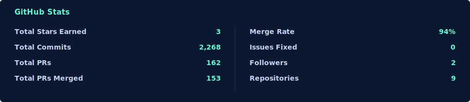
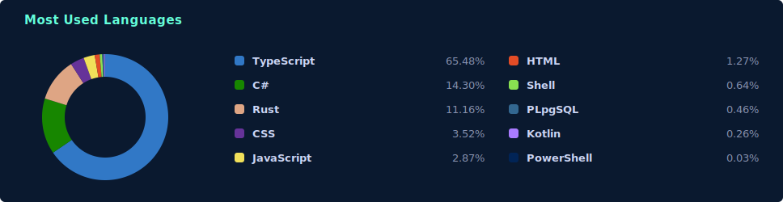
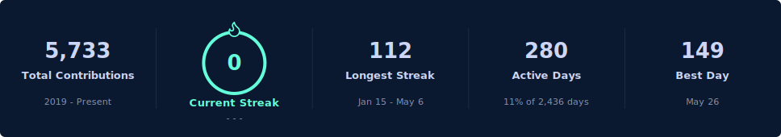
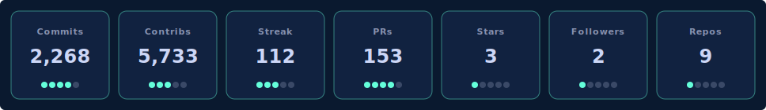

 

---

## What I work on

- **Security & compliance tooling** - CI security baselines, tamper-evident audit logging, SBOM/CVE evidence pipelines, AI evaluation environments
- **Backend & platform engineering** - .NET (Aspire, Orleans), Kubernetes, observability with OpenTelemetry, load-tested microservices
- **Desktop & mobile apps** - Tauri (Rust + React/Svelte), Flutter, Electron, .NET/Blazor
- **Intelligence tooling** - real-time data aggregation, MITM filter proxies, log correlation

## Stack

  
  
  
  
  
  
  

  
  
  
  
  
  

  
  
  
  
  

  
  
  
  
  
  
  
  
  

## Public projects

<table>
<tr>
<td width="50%" valign="top">

<a href="https://github.com/w1ck3ds0d4/GrainWallet"><strong>GrainWallet</strong></a>

Per-player wallet microservice on Microsoft Orleans, with each revision committed side by side and compared under an NBomber load dashboard. v2 hardens v1 with a `FOR UPDATE SKIP LOCKED` outbox, real LRU idempotency, HTTP 503 back-pressure, and pre-grain validation. Engineering journal, tests, and load harness per version.

`.NET` `Orleans` `PostgreSQL` `NBomber` `Microservices`

</td>
<td width="50%" valign="top">

<a href="https://github.com/w1ck3ds0d4/ThreatLens"><strong>ThreatLens</strong></a>

Log aggregation and correlation engine built on .NET Aspire. Ingest API for single and batch events, a background correlator that runs regex rules against messages to tag matches and elevate severity, a paginated query plus 24h stats API, and a Blazor dashboard. One `dotnet run` orchestrates Postgres, Redis, pgAdmin, and every service, with OpenTelemetry traces, metrics, and logs throughout.

`.NET Aspire` `C#` `Blazor` `PostgreSQL` `Redis`

</td>
</tr>
<tr>
<td width="50%" valign="top">

<a href="https://github.com/w1ck3ds0d4/SecureCheck"><strong>SecureCheck</strong></a>

Reusable multi-scanner security workflow for CI: secrets (gitleaks), SAST (Semgrep), dependency/container/license scanning (Trivy), per-language linters, complexity and duplication metrics - posted as one severity-coloured verdict per run, with an optional AI review step and Discord digest. Consumed as a single `workflow_call` across every repo here, and it scans itself.

`GitHub Actions` `gitleaks` `Semgrep` `Trivy` `Node.js`

</td>
<td width="50%" valign="top">

<a href="https://github.com/w1ck3ds0d4/GlassVault"><strong>GlassVault</strong></a>

Intentionally vulnerable multi-tenant document API used as evaluation infrastructure for AI cybersecurity (incident investigation, pen-testing, secure remediation, log forensics). 12 catalogued vulnerabilities, Express 5 + Apollo GraphQL, HMAC-SHA256 chained audit log, React admin UI.

`Express` `GraphQL` `Apollo` `SQLite` `React`

</td>
</tr>
<tr>
<td width="50%" valign="top">

<a href="https://github.com/w1ck3ds0d4/BlueFlame"><strong>BlueFlame</strong></a>

Privacy-first browser shell built on a local MITM filter proxy. Strips trackers, analytics, and fingerprinting at the network layer. Embedded Tor via arti, private tabs, bookmark folders, downloads, resource metrics, and a themed right-click menu.

`Tauri` `Rust` `React` `hudsucker` `arti`

</td>
<td width="50%" valign="top">

<a href="https://github.com/w1ck3ds0d4/NanoFarm"><strong>NanoFarm</strong></a>

Pixel-art isometric idle city builder shipping as both a Vite web app and a VS Code extension. 150x150 procgen biome map, farm + mine buildings with terrain bonuses, road connectivity via BFS, materials HUD. Claude Code hook drains tool calls from `~/.nanofarm/tokens.jsonl` into in-game resources.

`Vite` `React` `PixiJS` `VS Code` `Claude Code`

</td>
</tr>
</table>

Also public: <a href="https://github.com/w1ck3ds0d4/Purrmadeath"><strong>Purrmadeath</strong></a> - a 2D top-down co-op roguelike for up to 4 players (Electron + PixiJS): 3 classes with 10-tier skill trees, 8 multi-phase bosses, an embedded server for offline solo and hosted invite-code sessions online, signed auto-updater.

---

## Statistics

