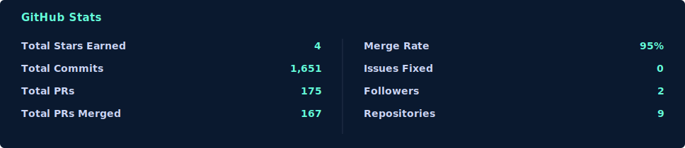
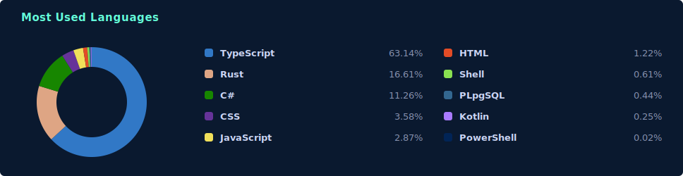
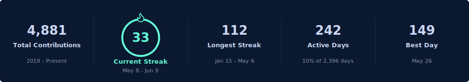

 

---

## EU Cyber Resilience Act compliance, as code

The CRA's first reporting obligations land **11 Sep 2026**, full obligations **11 Dec 2027**, with fines up to **EUR 15M / 2.5% of turnover**. I build the tooling that turns that from a deadline scramble into a CI artifact: an open-core ladder of free scanners feeding a paid dossier engine, so a regulated team stays continuously audit-ready instead of assembling evidence under pressure.

| Rung | What it does | State |
| --- | --- | --- |
| **CRA-Check** | Free GitHub Action: SBOM + vulnerability scan + repo evidence into 14 CRA Annex I gap checks | launching |
| **ProofLog** | Tamper-evident, identity-bound audit-log SDK (.NET): hash chain + HMAC/ECDSA signing + CRA/DORA/NIS2/AI-Act evidence export | launching |
| **[SecureCheck](https://github.com/w1ck3ds0d4/SecureCheck)** | Reusable security-scan workflow: gitleaks + Semgrep + Trivy + linters, one Discord verdict | public |
| **CRADesk** | The flagship: Annex VII technical documentation, Article 14 incident drafts, continuous CVE watch | commercial |

> Building the CRADesk product line under the **Wicked Kittens** studio. The free tools are how the value proves itself; the dossier engine is the product.

---

## What I work on

- **EU RegTech / compliance-as-code** - CRA / DORA / NIS2 evidence pipelines, SBOM + vulnerability handling, tamper-evident audit logs
- **Security & platform engineering** - Kubernetes security and SLA-readiness, DevSecOps, supply-chain scanning, observability
- **Backends & desktop** - .NET / C#, Python, Rust (Tauri), Node / Fastify, GraphQL, Postgres / SQLite

## Stack

  
  
  
  
  
  

  
  
  
  
  
  

---

## Selected public work

<table>
<tr>
<td width="50%" valign="top">

<a href="https://github.com/w1ck3ds0d4/SecureCheck"><strong>SecureCheck</strong></a>

Reusable security-scan workflow consumer repos call from their own CI: gitleaks, Semgrep, Trivy, per-language linters, and an optional Claude PR review, summarized as one severity-coloured Discord verdict. The embed logic is unit-tested.

`GitHub Actions` `Node.js` `gitleaks` `Semgrep` `Trivy`

</td>
<td width="50%" valign="top">

<a href="https://github.com/w1ck3ds0d4/ThreatLens"><strong>ThreatLens</strong></a>

Log aggregation and correlation engine on .NET Aspire. Ingest API, a background correlator running regex rules to tag matches and elevate severity, a paginated query + 24h stats API, and a Blazor dashboard. One `dotnet run` orchestrates Postgres, Redis, and every service with OpenTelemetry throughout.

`.NET Aspire` `C#` `Blazor` `PostgreSQL` `OpenTelemetry`

</td>
</tr>
<tr>
<td width="50%" valign="top">

<a href="https://github.com/w1ck3ds0d4/GlassVault"><strong>GlassVault</strong></a>

Intentionally vulnerable multi-tenant document API used as evaluation infrastructure for AI cybersecurity (incident investigation, pen-testing, secure remediation, log forensics). 12 catalogued vulnerabilities, Express 5 + Apollo GraphQL, HMAC-SHA256 chained audit log.

`Express` `GraphQL` `Apollo` `SQLite` `React`

</td>
<td width="50%" valign="top">

<a href="https://github.com/w1ck3ds0d4/BlueFlame"><strong>BlueFlame</strong></a>

Privacy-first browser shell built on a local MITM filter proxy. Strips trackers, analytics, and fingerprinting at the network layer. Embedded Tor via arti, private tabs, resource metrics.

`Tauri` `Rust` `React` `hudsucker` `arti`

</td>
</tr>
</table>

---

