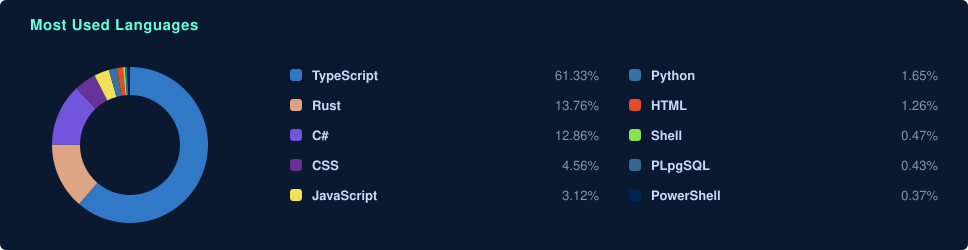
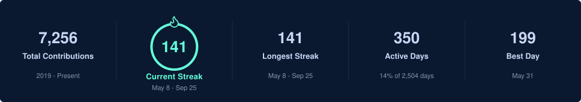
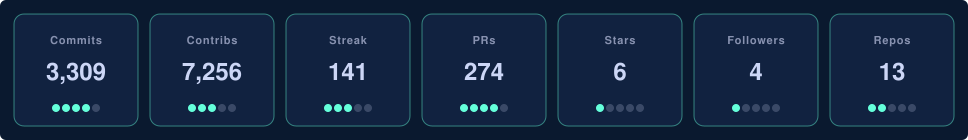

 

---

## What I work on

- **EU CRA compliance tooling** - SBOM and CVE evidence generated in CI, Annex VII technical documentation, tamper-evident audit logs; the commercial side runs under [WickIT Lab](https://wickitlab.com)
- **Security tooling** - CI security baselines, secret and dependency scanning, AI security evaluation environments
- **Backend & platform engineering** - .NET (Aspire, Orleans), Kubernetes, observability with OpenTelemetry, load-tested microservices
- **Desktop & mobile apps** - Tauri (Rust + React/Svelte), Flutter, Electron, .NET/Blazor
- **Games** - a co-op roguelike on PixiJS, and an RPG in progress on RPG Maker MZ
- **Intelligence tooling** - real-time data aggregation, MITM filter proxies, log correlation

## Stack

  
  
  
  
  
  
  

  
  
  
  
  
  

  
  
  
  
  

  
  
  
  
  
  
  
  
  

## Public projects

<table>
<tr>
<td width="50%" valign="top">

<a href="https://github.com/w1ck3ds0d4/CRA-Check"><strong>CRA-Check</strong></a>

Free GitHub Action that turns every build into EU Cyber Resilience Act evidence. It generates a CycloneDX SBOM, scans it for known vulnerabilities, and maps the results to the regulation's Annex I and Annex VII requirements.

`GitHub Actions` `Python` `CycloneDX` `SBOM` `EU CRA`

</td>
<td width="50%" valign="top">

<a href="https://github.com/w1ck3ds0d4/SecureCheck"><strong>SecureCheck</strong></a>

Reusable security pipeline for GitHub Actions. Secret scanning, static analysis, dependency and container checks run in a single pass and report one severity-graded verdict, with an optional AI review. Every repository here runs on it.

`GitHub Actions` `Gitleaks` `Semgrep` `Trivy` `Node.js`

</td>
</tr>
<tr>
<td width="50%" valign="top">

<a href="https://github.com/w1ck3ds0d4/BlueFlame"><strong>BlueFlame</strong></a>

Privacy-first desktop browser that blocks trackers, ads and fingerprinting at the network layer through its own local filtering proxy. Includes optional Tor routing, private tabs and a live privacy dashboard.

`Tauri` `Rust` `React` `hudsucker` `arti`

</td>
<td width="50%" valign="top">

<a href="https://github.com/w1ck3ds0d4/ThreatLens"><strong>ThreatLens</strong></a>

Log aggregation and correlation engine on .NET Aspire. Events arrive through an ingest API, a background correlator applies detection rules to flag and escalate matches, and a Blazor dashboard presents the results with full OpenTelemetry tracing.

`.NET Aspire` `C#` `Blazor` `PostgreSQL` `Redis`

</td>
</tr>
<tr>
<td width="50%" valign="top">

<a href="https://github.com/w1ck3ds0d4/GrainWallet"><strong>GrainWallet</strong></a>

Per-player wallet microservice on Microsoft Orleans, built in versions that are load-tested side by side. The second version adds a transactional outbox, request idempotency and back-pressure, each measured under load and documented in an engineering journal.

`.NET` `Orleans` `Kafka` `PostgreSQL` `NBomber`

</td>
<td width="50%" valign="top">

<a href="https://github.com/w1ck3ds0d4/RimDocPlus"><strong>RimDoc+</strong></a>

Desktop app that diagnoses, repairs and supervises a modded RimWorld install. Load-order analysis and per-mod crash attribution pinpoint what broke, and every fix is a reviewable plan with its own rollback and a backup made first.

`Tauri` `Rust` `TypeScript` `React` `C#`

</td>
</tr>
</table>

---

## Statistics

