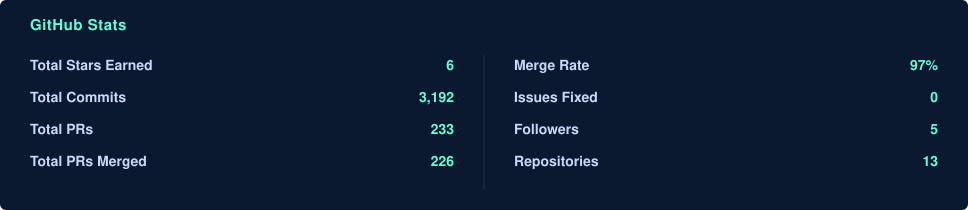
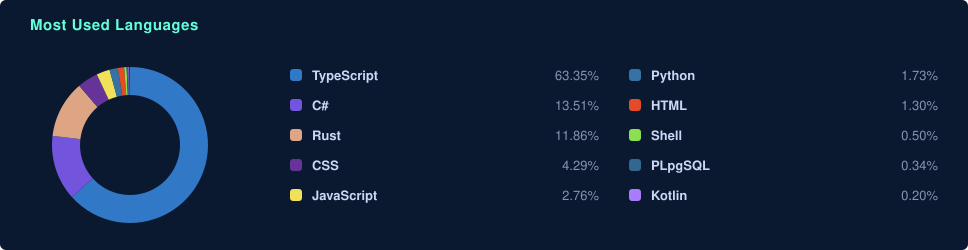

I'm Daniel, a software engineer in Malta. I build security and compliance tooling for small
software teams, and the backend and desktop software around it, mostly in C#, TypeScript and Rust.

Most of my work right now is about the EU Cyber Resilience Act: helping teams that ship software
produce the evidence the regulation asks for (SBOMs, vulnerability handling, technical
documentation) straight from their CI, without needing a compliance department. That work runs
under [WickIT Lab](https://wickitlab.com).

## Compliance and security tooling

**[CRA-Check](https://github.com/w1ck3ds0d4/CRA-Check)**  
A free GitHub Action that builds a CycloneDX SBOM, checks it against known CVEs and writes CRA
evidence mapped to Annex I and Annex VII on every build.  
`GitHub Actions` `Python` `CycloneDX`

**[SecureCheck](https://github.com/w1ck3ds0d4/SecureCheck)**  
One reusable workflow that runs gitleaks, Semgrep, Trivy and per-language linters, then posts a
single verdict per run. Every project on this profile runs it, including SecureCheck itself.  
`GitHub Actions` `gitleaks` `Semgrep` `Trivy`

**[ProofLog](https://github.com/w1ck3ds0d4/ProofLog)**  
A .NET library for hash-chained, ECDSA-signed audit logs: records that show when they have been
altered and who wrote each entry.  
`.NET` `C#` `ECDSA`

**CRADesk**  
The commercial side of this work: Annex VII technical documentation, CVE monitoring and incident
report drafts for small software teams. The code is private; the offer is on
[wickitlab.com](https://wickitlab.com).

## Other work

**[RimDoc+](https://github.com/w1ck3ds0d4/RimDocPlus)**  
A desktop app that diagnoses, repairs and supervises a modded RimWorld install. Repairs are plans,
not actions: one plan drives the interface, a readable PowerShell script and its own rollback, and
every write is backed up first.  
`Tauri` `Rust` `TypeScript` `React`

**[Griddy](https://github.com/w1ck3ds0d4/Griddy)**  
An independent, tamper-evident public archive of Malta's power outages. Each capture is chained
to the one before it, so the record cannot be quietly rewritten.  
`Python` `GitHub Actions`

**[GrainWallet](https://github.com/w1ck3ds0d4/GrainWallet)**  
A per-player wallet microservice on Microsoft Orleans, with each revision kept side by side and
compared under load. The second version adds a `FOR UPDATE SKIP LOCKED` outbox, real idempotency
and back-pressure.  
`.NET` `Orleans` `PostgreSQL` `NBomber`

**[ThreatLens](https://github.com/w1ck3ds0d4/ThreatLens)**  
Log aggregation and correlation on .NET Aspire: an ingest API, a rule-based correlator, a query
and stats API and a Blazor dashboard, with OpenTelemetry throughout. One `dotnet run` starts the
whole stack.  
`.NET Aspire` `Blazor` `PostgreSQL` `Redis`

**[BlueFlame](https://github.com/w1ck3ds0d4/BlueFlame)**  
A privacy-first browser shell that strips trackers at the network layer through a local filtering
proxy, with optional Tor routing through arti.  
`Tauri` `Rust` `React`

**[Purrmadeath](https://github.com/w1ck3ds0d4/Purrmadeath)**  
A 2D co-op roguelike for up to four players. The same embedded server runs solo and online
sessions, so there is one code path instead of two.  
`Electron` `PixiJS` `TypeScript`

**[GlassVault](https://github.com/w1ck3ds0d4/GlassVault)**  
A deliberately vulnerable multi-tenant document API for evaluating security tooling. Not for
production use.  
`TypeScript` `Node.js`

## Stack

**Languages:** C#, TypeScript, Rust, Python, Dart  
**Backend and platform:** .NET (ASP.NET Core, Aspire, Orleans, EF Core), Node.js, PostgreSQL,
Redis, SQLite, Docker, Kubernetes, OpenTelemetry, GitHub Actions  
**Apps:** React, Tauri, Flutter, Electron, Blazor  
**Security:** supply-chain and CI hardening, SBOMs, SAST, secret scanning, tamper-evident logging

## Activity

## Contact

Email: [daniel.svs@outlook.com](mailto:daniel.svs@outlook.com)  
Web: [wickitlab.com](https://wickitlab.com)
